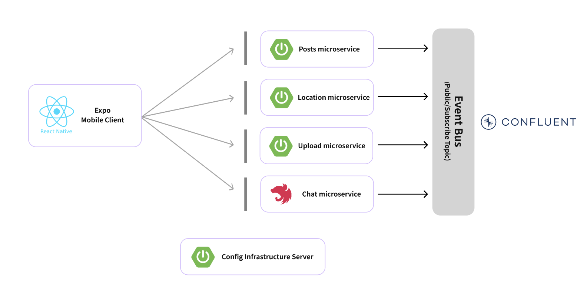
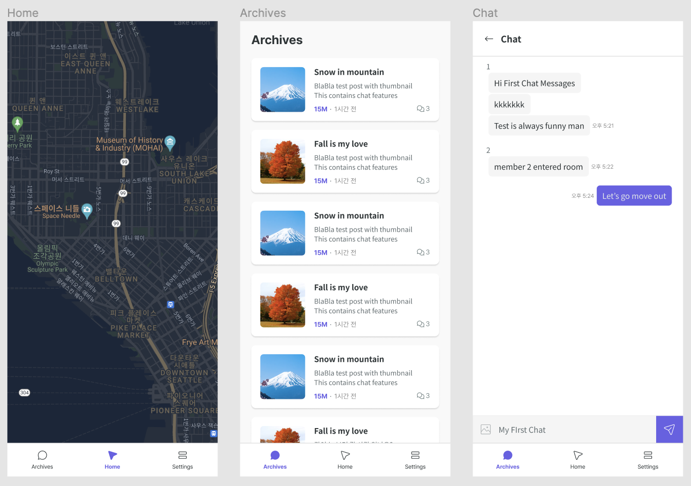

# BlaBla Mobile

**BlaBla** is a location-based social media application built with **React Native** and **Expo**. This project demonstrates a complete mobile application with real-time communication, location tracking, and social features integrated with a microservice backend architecture.

## Overview

BlaBla allows users to:
- Share location-based posts with nearby users
- Real-time chat and messaging
- Discover and interact with posts in their area
- Manage their profile and preferences
- Archive and view post history

## Tech Stack

- **Frontend**: React Native (Expo)
- **Language**: TypeScript
- **State Management**: Recoil
- **Real-time**: WebSocket
- **Localization**: i18n

## Project Structure

```
src/
├── components/      # Reusable UI components
├── screens/        # Screen/page components
├── navigation/     # Navigation configuration
├── services/       # API & service layer
├── hooks/         # Custom React hooks
├── recoils/       # Recoil state management
├── dtos/          # Data transfer objects
├── configs/       # Configuration files
├── utils/         # Utility functions
├── helpers/       # Helper functions
├── i18n/          # Internationalization
└── themes.ts      # Theme configuration
```

## Related Repositories

This is the **mobile frontend** for BlaBla. The complete system includes several backend microservices:

| Component | Repository |
|-----------|-----------|
| Mobile App | [blabla-mobile](https://github.com/SaaS-MVP-Master/mobile-mvp-test) |

**Architecture**: Microservices with Azure cloud infrastructure

**Note:** This document is about the mobile apps using **React Native Expo**.

# Application Diagram

<p align="center">

</p>

# Application Screens

<p align="center">

</p>
